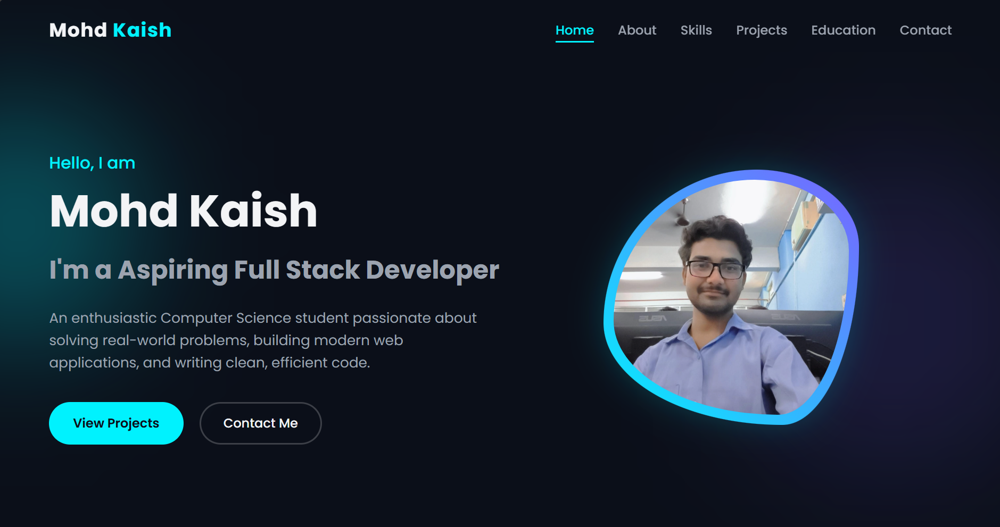
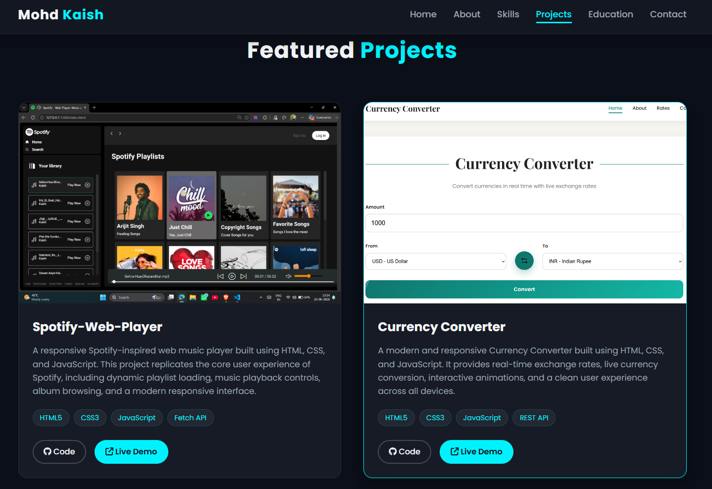
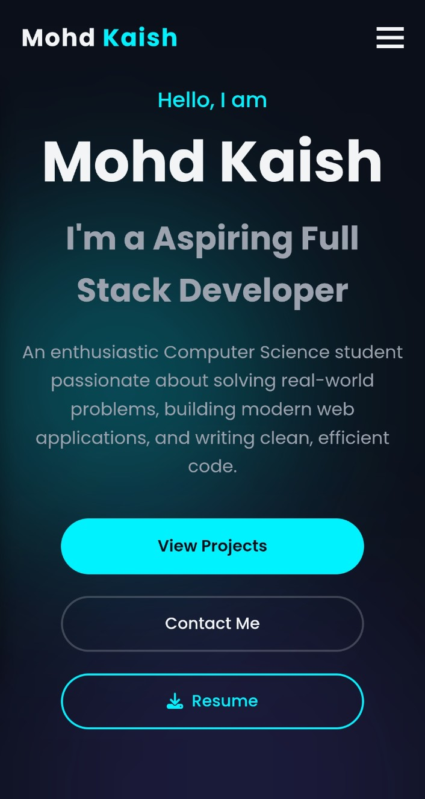
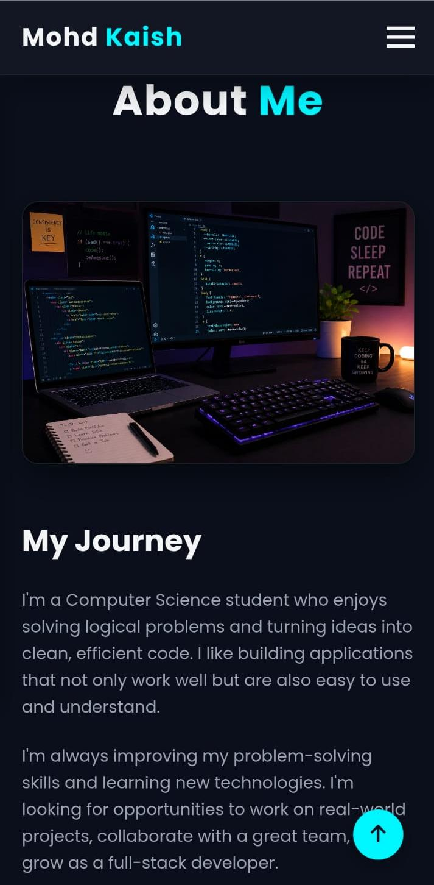

# 🌐 Personal Portfolio Website

A modern, responsive, and interactive personal portfolio website built using **HTML, CSS, and JavaScript** during my internship at **Cerso** (Task 2). The portfolio showcases my skills, projects, education, and contact information with a clean UI and smooth user experience.

## 🚀 Live Demo


## 📸 Preview

### Home


### Projects


### Mobile View
<p align="center">
  
  &nbsp;&nbsp;&nbsp;&nbsp;&nbsp;&nbsp;&nbsp;&nbsp;&nbsp;&nbsp;&nbsp;&nbsp;&nbsp;&nbsp;&nbsp;&nbsp;
  
</p>

---

## ✨ Features

- 🎨 Modern and responsive UI
- 📱 Mobile-friendly design
- 📄 Download Resume button
- ⚡ Smooth scrolling and reveal animations
- 📌 Sticky navigation bar
- 🔍 Active navigation highlighting
- ⬆️ Back-to-top button
- 🧑 About Me section
- 💻 Skills showcase
- 📂 Featured Projects section
- 🎓 Education timeline
- 📬 Contact form with client-side validation
- 🌙 Clean dark theme

---

## 🛠️ Tech Stack

- HTML5
- CSS3
- JavaScript (ES6)
- Font Awesome
- Google Fonts

---

## 📁 Project Structure

```
Portfolio/
│── index.html
│── style.css
│── script.js
│── assets/
│── README.md
```

---

## ⚙️ Getting Started

1. Clone the repository

```bash
git clone https://github.com/kaish10-hub/personal-portfolio.git
```

2. Navigate to the project folder

```bash
cd personal-portfolio
```

3. Open `index.html` in your browser.

---

## 📌 Sections Included

- Home
- About
- Skills
- Projects
- Education
- Contact

---

## 📈 Future Improvements

- EmailJS integration for contact form
- Dark/Light mode toggle
- Project filtering
- Blog section
- More animations and accessibility improvements

---

## 👨‍💻 Author

**Mohd Kaish**

- GitHub: https://github.com/kaish10-hub
- LinkedIn: https://www.linkedin.com/in/mohd-kaish10

---

## ⭐ Show your support

If you like this project, consider giving it a ⭐ on GitHub!

---
© 2026 Mohd Kaish. All Rights Reserved.
